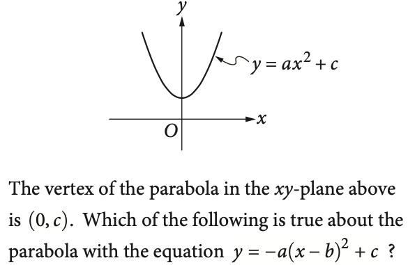

<!-- slide -->
$\hspace{5cm}$ Monday 31 October

### 4.1 Exponential functions

- Learning Target: I can model compound growth
- Do Now: Find the sum of $2+3x$ and $4+8x$
- Lesson: Test review, group work problems
- Homework: Test corrections, Khan Academy SAT practice

<!-- slide -->

What is the result of dividing the circumference
of a pumpkin by its diameter?

<!-- slide -->

What is the circumference of a pumpkin divided by its diameter?

*Pumpkin* $\, \large \pi$!

<!-- slide -->

#### SAT practice test *debrief*

- $(2+3i)+(4+8i)=6+11i$
- Solve for $l$ given $n = 7lh$
- Expand $\displaystyle \left(a+\frac{b}{2}\right)^2$
- Find $p$ given $4x^2 − 9 = (px + t)(px − t)$

<!-- slide -->

$$\frac{2}{3}t=\frac{5}{2}$$

What value of $t$ is the solution of the equation above?

<!-- slide -->

- A. It opens upward
- B. It opens downward

<!-- slide -->

#### Prepare for the SAT: stamina

- [Sal Khan: Process versus goals focus](https://www.youtube.com/watch?v=_lyyvZFiAjQ)

- Next weekend: Complete a full SAT practice test (3 hours) [link](https://www.khanacademy.org/mission/sat)

<!-- slide -->

$\hspace{5cm}$ Monday 2 November

### 4.2 Exponential functions

- Learning Target: I can model compound growth
- Do Now: Given $P_0=\$100$, $r=10\%$, $n=7$ find
$$P=P_0(1+r)^n$$
- Lesson: Test review, group work problems
- Homework: Khan Academy SAT practice
