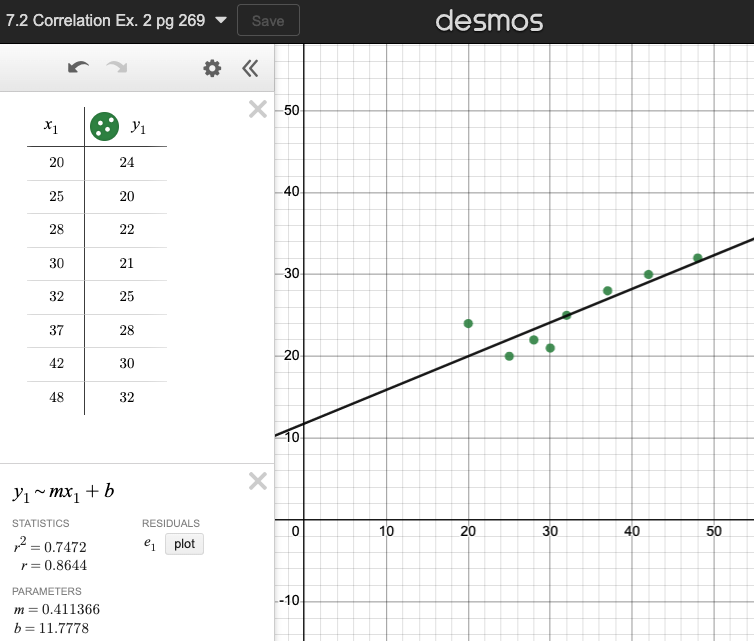
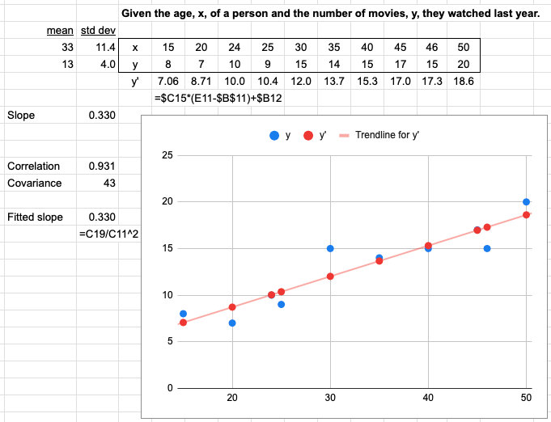

<!-- slide -->
$\hspace{5cm}$ Tuesday 3 January

### 7.1 Bivariate data

- Learning Target: I can use scatter plots to compare two variables
- Do Now: Estimate the mean, median, mode of math grades
- Lesson: Evaluating correlation graphically
- Homework: Khan Academy statistics unit due Friday

<!-- slide -->

### Correlation is not causation

- Introduction to bivariate data: textbook pages 133-138
  - Two variables ($x$ and $y$)
  - Independent variable (horizontal axis)
    - e.g. time, distance, number
  - Dependent variable (vertical axis)
    - height, money, result

<!-- slide -->

$\hspace{5cm}$ Wednesday 4 January

### 7.2 Pearson's correlation coefficient $r$

- Learning Target: I can estimate correlation
- Lesson: Quantifying linear fit, pages 262-273

<!-- slide -->

#### STEM Correlation (Example 2 p269)

Eight students' course results

| Course | 1 | 2 | 3 | 4 | 5 | 6 | 7 | 8 |
| --- | --- | --- | --- | --- | --- | --- | --- | --- |
| Math (y) | 20 | 25 | 28 | 30 | 32 | 37 | 42 | 48 |
| Biology (x) | 24 | 20 | 22 | 21 | 25 | 28 | 30 | 32 |

[Desmos link](https://www.desmos.com/calculator/kbjsrfa0hc)

<!-- slide -->

<!-- slide -->

$\hspace{4cm}$ Thursday 5 January

### 7.3 Graphing bivariate data and calculating correlation

- Learning Target: I can compute the five-figure summary
- Do Now: Example 3a page 101
- Lesson: Calculator summary statistics, pages 106-112
- SAT practice test Thursday

<!-- slide -->

$\hspace{4cm}$ Monday 9 January

### 7.4 LT: I can plot a line of best fit

- Do Now: Categorize each term as one of 3 measures
**Central Tendency | Spread | Bivariate Relationship**
Range, Average, Correlation, IQR, Median, Standard deviation, Pearson's "r", Variance, Mode, Scatter plot,
Non-linear, Outlier, Box & whisker plot

- Khan Academy homework due tonight 10PM

<!-- slide -->

[link to Desmos graph](https://www.desmos.com/calculator/thq0jrxmy2)

<!-- slide -->

<!-- slide -->

$\hspace{4cm}$ Wednesday 11 January

### 7.5 Pre-Exam: Bivariate data spreadsheet analysis

- Learning Target: I can employ predictive modeling
- Lesson: Using a linear regression model to predict
- Unit test tomorrow

<!-- slide -->

$\hspace{4cm}$ Thursday 12 January

### 7.6 Exam: Bivariate data graphing and calculations

- Google sheets spreadsheet based
- Summary statistics, frequency table analysis
- Scatter plot, correlation, and predictive modeling

<!-- slide -->

$\hspace{4cm}$ Wednesday 18 January

### 7.7 LT: I can solve SAT problems

- Do Now: Statistics calculator graphing
- Lesson: [Word problems](7-7SAT-stats-word-problems)
- Khan Academy homework due Friday 10PM

<!-- slide -->

#### Do Now: A 6-sided die is rolled 10 times

- What is the mode?
- List the results in alphabetic order

| Outcome | a | b | c | d | e | f |
| --- | --- | --- | --- | --- | --- | --- |
| Frequency | 2 | 1 | 2 | 0 | 3 | 2 |

<!-- slide -->

$\hspace{4cm}$ Wednesday 18 January

### 7.8 LT: I can solve SAT problems

- Do Now: Statistics calculator graphing
- Word problems
- Khan Academy homework due Friday 10PM

<!-- slide -->

$\hspace{4cm}$ Thursday 19 January

### 7.9 LT: SAT Practice test

- Multiple choice
- Word problems
- Khan Academy homework due Friday 10PM

<!-- slide -->

$\hspace{4cm}$ Monday 23 January

### 7.9 LT: I can model data with a line of best fit

- Free response
- Word problems
- Next class Wednesday February 1st
- Take Khan Academy SAT practice tests!

<!-- slide -->

#### Do Now: A 6-sided die is rolled 10 times

- What is the mode?
- List the results in alphabetic order

| Outcome | a | b | c | d | e | f |
| --- | --- | --- | --- | --- | --- | --- |
| Frequency | 2 | 1 | 2 | 0 | 3 | 2 |