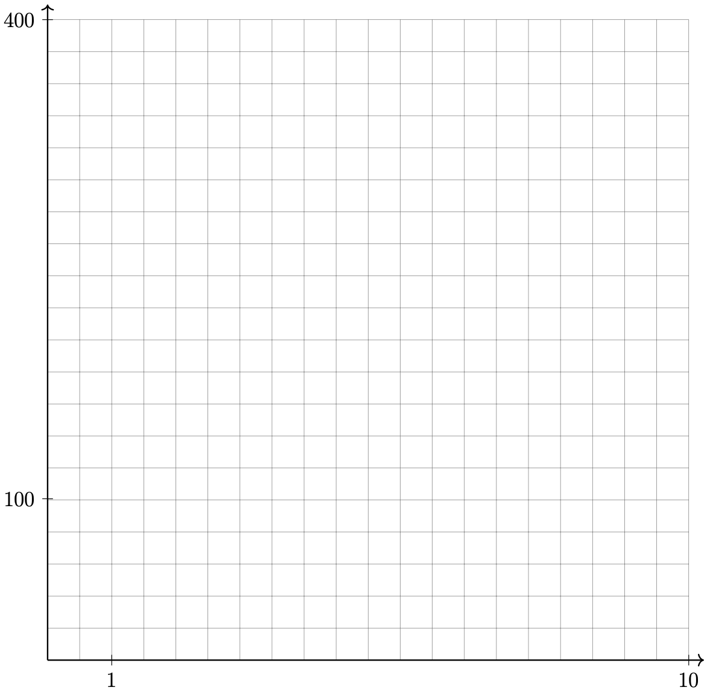

La Scuola d'Italia / Huson / IB Math: Sequences 

23 October 2025

# 1.12 Classwork: Series; due Tuesday 28 October

1. Given a geometric sequence with $u_1=9$ and $r=\frac{4}{3}$

    1. Find $u_8$.

    Solution: 
    $u_8 = 9 \cdot \left(\frac{4}{3}\right)^{8-1}$

    $= \frac{16384}{243} = 67.42386\dots$
    $\approx  67.4$

    2. Find $S_8$, the sum of the first eight terms of the sequence.

    Solution:
    $\displaystyle S_8 = 9 \cdot \frac{\left(\frac{4}{3}\right)^{8}-1}{\frac{4}{3}-1}$

    $= \frac{58975}{243} = 242.695 \dots$

    $\approx 243$

    3. $S_k \approx 825.37$. Find $k$ algebraically.

    Solution:
        $$
        \begin{aligned}
        S_k = 9 \cdot \frac{\left(\frac{4}{3}\right)^{k}-1}{\frac{4}{3}-1} &= 825.37 \\
        \left(\frac{4}{3}\right)^{k} &= 36.5693 \dots \\
        k &= \log_{\frac{4}{3}} 36.5693 \dots  \\
                &\approx 12
        \end{aligned}
        $$

2. Three consecutive terms of a geometric sequence are $x-2$, 6, and $x+7$. 
    Find the possible values of $x$.

3. Find the value of each of the following, as an integer. (no calculator)

    1. $\log_6 36$.

    2. $\log_6 4 + \log_6 9$.

    3. $\log_6 2 - \log_6 12$.

4. Solve $\log_2 x + \log_2 (x-2) = 3$, for $x>2$.

5. Solve the equation $e^x = 4 \sin x$, for $0 \leq x \leq 2 \pi$. (calculator allowed)

6. The expression $(x + a)(x + b)$ can not be written as

    1. $a(x + b)+ x(x + b)$

    2. $x^2 + (a + b)x + ab$

    3. $x^2 + abx + ab$

    4. $x(x + a)+ b(x + a)$

7. Graph $y=400(.85)^{2x}-6$ on the set of axes below.

