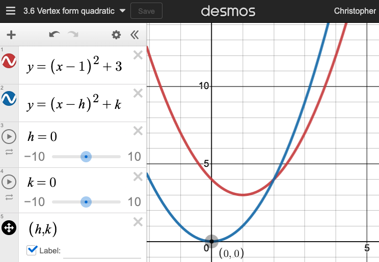
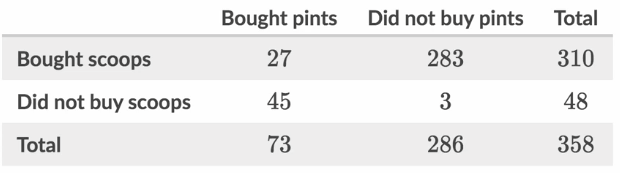

<!-- slide -->
$\hspace{5cm}$ Thursday 7 September

### 1.1 Learning target & Do Now

Learning Target: I can read and interpret table data

- Do Now: Is the point $(2,4)$ on the line
$$y=4x-2$$
- *Calculator checkss*
- Homework: Khan practice problems [link](https://www.khanacademy.org/mission/sat)
- **Exit note: Jumprope surveys**

<!-- slide -->

1. In the $xy$-plane, the point (3, 5) lies on the graph of the function $f$. If $f(x)=x^2+a$, where $a$ is a constant, what is the value of $a$?

- Solution: <!-- .element: class="fragment" data-fragment-index="1" -->
- $f(3)=3^2+a=5$ <!-- .element: class="fragment" data-fragment-index="1" -->
- $\hspace{1.8cm}$ $a=5-9 = -4$ <!-- .element: class="fragment" data-fragment-index="1" -->

<!-- .slide: data-align="left" -->

2. A football club is planning a new field. The length of the field will be 40 yards longer than the width. If the area of the field is to be 2100 square yards, what will be the field's dimensions?

Solution: <!-- .element: class="fragment" data-fragment-index="1" -->

$$x(x+40)=2100 \\ x^2+40x-2100=0 \\ (x-40)(x+70)=0 \\ x=40, -70$$ <!-- .element: class="fragment" data-fragment-index="1" -->

<!-- slide -->

$$y=(x-1)^2+3$$

Use this [Desmos link](https://www.desmos.com/calculator/seeud05djh) to graph $y=(x-h)^2+k$

<!-- .slide: data-align="left" -->

### Top of slide

- left justify
- not centered vertically
